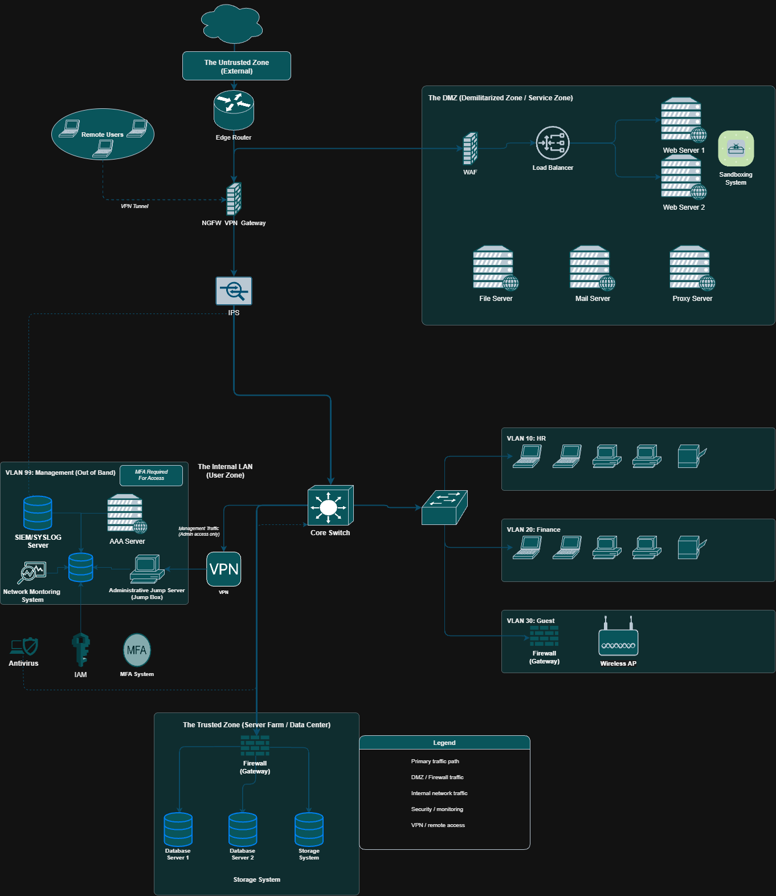

# 🔐 Secure Network Topology Design

A multi-zone enterprise network architecture built around defense-in-depth principles — separating untrusted, public-facing, internal, and administrative traffic into isolated security zones with controlled access paths between them.



---

## Overview

This project documents the design of a secure enterprise network with five distinct security zones, VLAN segmentation for internal user groups, and a dedicated out-of-band management network. The design aims to minimize the blast radius of a breach by ensuring no zone can directly reach another without passing through a control point.

---

## Architecture

### Security Zones

|           Zone                 |          Purpose          |           Key Controls              |
|--------------------------------|---------------------------|-------------------------------------|
| **Untrusted Zone**             | External internet traffic | Edge Router                         |
| **DMZ (Service Zone)**         | Public-facing services    | WAF, Load Balancer, Sandboxing      |
| **Internal LAN (User Zone)**   | Employee workstations     | Core Switch, VLAN segmentation      |
| **Trusted Zone (Data Center)** | Databases and storage     | Firewall gateway, restricted access |
| **Management Zone (OOB)**      | Admin and monitoring      | MFA-required, jump box enforced     |

### Internal VLANs

|  VLAN   |   Segment  |                 Purpose                      |
|---------|------------|----------------------------------------------|
| VLAN 10 | HR         | Human Resources workstations                 |
| VLAN 20 | Finance    | Finance workstations — elevated isolation    |
| VLAN 30 | Guest      | Wireless guest access via dedicated firewall |
| VLAN 99 | Management | Out-of-band admin traffic only               |

---

## Security Controls

### Perimeter
- **Edge Router** — first-hop filtering at the internet boundary
- **NGFW / VPN Gateway** — next-generation firewall with site-to-site and remote-access VPN
- **IPS (Intrusion Prevention System)** — inline traffic inspection before reaching the internal LAN

### DMZ
- **WAF (Web Application Firewall)** — filters HTTP/S traffic before it hits web servers
- **Load Balancer** — distributes traffic across Web Server 1 and Web Server 2
- **Sandboxing System** — isolates and analyzes suspicious files before they enter the network
- **File Server, Mail Server, Proxy Server** — segmented within the DMZ, not directly reachable from the internet

### Internal Network
- **Core Switch** — central distribution point with VLAN enforcement
- **VLAN Segmentation** — HR, Finance, and Guest traffic are isolated from each other
- **Guest VLAN Firewall** — Guest wireless traffic is gated through a dedicated gateway before reaching any internal resource

### Management (Out-of-Band)
- **AAA Server** — centralized Authentication, Authorization, and Accounting
- **SIEM / SYSLOG Server** — aggregates and correlates logs from across the network
- **Network Monitoring System** — continuous visibility into network health and anomalies
- **Administrative Jump Server (Jump Box)** — all admin access flows through a single, audited entry point
- **IAM** — identity and access management for all administrative accounts
- **MFA System** — multi-factor authentication enforced for every management zone login
- **Antivirus** — endpoint protection on administrative systems

### Remote Access
- **VPN (Remote Users)** — encrypted tunnel for remote employees; traffic enters through the NGFW/VPN Gateway, not directly into the LAN

---

## Traffic Flow

```
Internet
   │
   ▼
Edge Router
   │
   ├──► DMZ (WAF → Load Balancer → Web Servers / Mail / File / Proxy)
   │
   ▼
NGFW / VPN Gateway
   │
   ▼
IPS
   │
   ▼
Core Switch
   ├──► VLAN 10 (HR)
   ├──► VLAN 20 (Finance)
   ├──► VLAN 30 (Guest → Firewall → Wireless AP)
   └──► Trusted Zone (Firewall → DB Servers / Storage)

Management traffic (VLAN 99) is completely isolated — admin access
requires VPN + MFA + Jump Box before reaching any managed device.
```

---

## Design Decisions

**Why a separate management VLAN (OOB)?**
Mixing management traffic with user traffic means a compromised workstation can attempt to reach network devices directly. VLAN 99 ensures that even a fully compromised user zone gives an attacker no path to routers, switches, or servers without going through the jump box.

**Why a sandboxing system in the DMZ?**
Files arriving via mail or web need inspection in an environment where detonating malware has no access to internal resources. Placing the sandbox in the DMZ isolates that risk.

**Why a dedicated firewall for the Guest VLAN?**
Guest devices are unmanaged and untrusted. Routing guest wireless through its own gateway (rather than the core switch) prevents guests from ever being on the same broadcast domain as employee traffic.

**Why a jump box for admin access?**
A single, hardened entry point means all admin sessions are logged, monitored, and controllable in one place — rather than allowing direct SSH/RDP from any management workstation.

---

## Tools Used

- **Diagram:** Draw.io 
- **Standards referenced:** NIST SP 800-41 (Firewall Guidelines), CIS Controls v8, ISO/IEC 27001

---

## What I Learned

- Designing for **lateral movement prevention** — not just perimeter defense
- The operational difference between **stateful firewalls** and **next-gen firewalls** in a real topology
- Why **out-of-band management** matters and how to implement it without overcomplicating the design
- How **VLAN segmentation** maps to actual business units and their risk profiles


---

## Author

**Omar Sherif Shaker**
Network Security | Infrastructure Design
[LinkedIn](https://www.linkedin.com/in/omar-sherif-440a44383/) · [GitHub](https://github.com/OmarSherif01)
